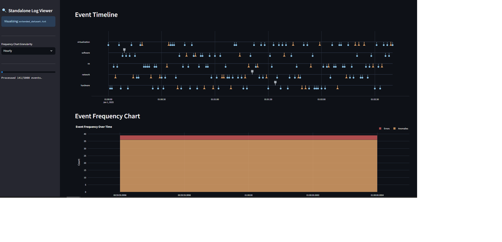

# Система анализа логов реального времени



Данный проект представляет собой многокомпонентную систему для анализа лог-файлов, поиска причинно-следственной связи между ошибками и аномалиями, а также уведомления пользователей о найденных связях. Система построена на микросервисной архитектуре с использованием Docker, Kafka, Redis и FastAPI.


## Содержание

- [Архитектура](#архитектура)
- [Сервисы](#сервисы)
  - [Replay](#replay)
  - [Backend](#backend)
  - [Frontend](#frontend)
  - [Kafka & Zookeeper](#kafka--zookeeper)
  - [Redis](#redis)
- [Технологический стек](#технологический-стек)
- [Начало работы](#начало-работы)
  - [Предварительные требования](#предварительные-требования)
  - [Конфигурация](#конфигурация)
  - [Запуск](#запуск)
  - [Проверка работы](#проверка-работы)
  - [Остановка](#остановка)
- [Структура проекта](#структура-проекта)

## Архитектура

Система состоит из нескольких независимых сервисов, оркестрируемых с помощью Docker Compose. Сервисы взаимодействуют друг с другом асинхронно через брокер сообщений Apache Kafka.

1.  **Replay**: Имитирует источники логов, читая текстовые файлы и отправляя их в Kafka.
2.  **Kafka**: Принимает и хранит потоки логов.
3.  **Backend**: Основной аналитический сервис. Он подписывается на топики Kafka, обрабатывает логи в реальном времени, используя ML-модель для поиска семантической близости, и сохраняет результаты. Также предоставляет REST API для ручного анализа.
4.  **Redis**: Используется для кэширования векторов (эмбеддингов) текстовых сообщений, что значительно ускоряет повторную обработку.
5.  **Frontend**: Веб-интерфейс на Streamlit, который позволяет пользователям загружать файлы логов вручную, запускать анализ через API бэкенда и визуализировать результаты на интерактивном графике.

Помимо потоковой обработки через Kafka, система поддерживает уведомления в Telegram о найденных связях аномалий и ошибок.

## Сервисы

### Replay

-   **Назначение**: Имитация работы реальной системы, генерирующей логи.
-   **Логика работы**:
    -   Сканирует директорию `/logs` внутри контейнера (смонтированную из `./data/logs` на хосте) на наличие файлов `.txt` и `.log`.
    -   Читает все найденные файлы, парсит строки и сортирует их по временной метке.
    -   Отправляет сообщения в Kafka в формате JSON. Имя топика генерируется на основе имени файла лога (например, `app_server1_log.txt` -> топик `logs.app_server1_log`).
    -   Работает в бесконечном цикле, повторяя отправку логов для непрерывного тестирования.
-   **Технологии**: Python, `aiokafka`.

### Triton Inference Server

-   **Назначение**: Высокопроизводительный сервер инференса для ML-моделей.
-   **Логика работы**:
    -   Предоставляет оптимизированный инференс модели `microsoft/codebert-base` через HTTP/gRPC API.
    -   Поддерживает батчинг запросов для повышения производительности.
    -   Автоматически управляет GPU памятью и обеспечивает параллельную обработку.
    -   Предоставляет метрики Prometheus для мониторинга производительности.
-   **Технологии**: NVIDIA Triton Inference Server, Python Backend, CUDA.
-   **Порты**: 8001 (HTTP), 8002 (gRPC), 8003 (Metrics).

### Backend

-   **Назначение**: Центральный сервис для анализа и обработки данных.
-   **Логика работы**:
    -   **Kafka Consumer**: В фоновом режиме слушает все топики Kafka с префиксом `logs.`. При получении сообщений `ERROR` или `WARNING` сохраняет их во временном окне для анализа.
    -   **Аналитическое ядро**: Использует модель `SentenceTransformer` (`microsoft/codebert-base`) для преобразования текстовых сообщений в числовые векторы (эмбеддинги). Сравнивает эмбеддинги ошибок и аномалий в заданном временном окне. Если косинусная близость превышает порог, пара считается связанной.
    -   **REST API (FastAPI)**: Предоставляет эндпоинт `/analyze-logs/` для загрузки файлов (`anomalies_problems.csv` и логов) и их анализа "по запросу".
    -   **Telegram Бот**: Интегрирован с `aiogram`. Пользователи могут подписаться на уведомления. При нахождении связи (как из Kafka, так и через API) бот отправляет уведомление всем подписчикам.
    -   **Кэширование**: Активно использует Redis для кэширования эмбеддингов. Перед вычислением вектора для текстового сообщения сервис проверяет его наличие в кэше, что значительно снижает нагрузку на CPU/GPU при обработке повторяющихся логов.
-   **Технологии**: Python, FastAPI, `kafka-python`, `tritonclient`, `torch`, `aiogram`, Redis.

### Frontend

-   **Назначение**: Пользовательский интерфейс для взаимодействия с системой.
-   **Логика работы**:
    -   Позволяет загрузить файл с описанием аномалий и проблем, а также один или несколько файлов логов.
    -   При нажатии кнопки "Анализировать" отправляет файлы на эндпоинт `/analyze-logs/` сервиса `backend`.
    -   Получает в ответ CSV/XLSX-файл с результатами анализа логов.
    -   Отображает результаты в виде таблицы и строит интерактивный временной график (timeline) с помощью Plotly, на котором визуализированы найденные связи между ошибками и аномалиями.
-   **Технологии**: Python, Streamlit, Pandas, Plotly, Requests.

### Kafka & Zookeeper

-   **Назначение**: Брокер сообщений, обеспечивающий асинхронное и отказоустойчивое взаимодействие между сервисами.
-   **Конфигурация**: Используются стандартные образы от Confluent. Настроен для автоматического создания топиков, когда `replay` начинает в них писать.

### Redis

-   **Назначение**: In-memory база данных, используемая для кэширования.
-   **Логика работы**: Хранит пары `ключ:значение`, где ключ — это предварительно обработанное текстовое сообщение из лога, а значение — его сериализованный вектор (эмбеддинг).

## Технологический стек

-   **Оркестрация**: Docker, Docker Compose
-   **Бэкенд**: Python, FastAPI, PyTorch, Sentence-Transformers, Aiogram
-   **Инференс**: NVIDIA Triton Inference Server, TritonClient
-   **Фронтенд**: Python, Streamlit, Plotly
-   **Брокер сообщений**: Apache Kafka
-   **Кэширование**: Redis
-   **Модель ML**: `microsoft/codebert-base`

## Начало работы

### Предварительные требования

-   Установленный [Docker](https://www.docker.com/products/docker-desktop/) и Docker Compose.
-   Git для клонирования репозитория.
-   **Для Triton сервиса**: NVIDIA GPU с поддержкой CUDA и [NVIDIA Container Toolkit](https://docs.nvidia.com/datacenter/cloud-native/container-toolkit/install-guide.html).

### Конфигурация

Перед первым запуском необходимо настроить переменные окружения.

1.  **Telegram Бот**:
    -   Создайте бота в Telegram через `@BotFather` и получите его токен.
    -   Откройте файл `docker-compose.yml`.
    -   Найдите сервис `backend` и в секции `environment` замените значение переменной `TELEGRAM_BOT_TOKEN` на ваш токен.

2.  **Данные для анализа**:
    -   Поместите файлы логов в формате `.txt` или `.log` в директорию `data/logs/`.
    -   Убедитесь, что файл `data/anomalies_problems.csv` содержит актуальный справочник аномалий и проблем.

### Запуск

Выполните следующую команду из корневой директории проекта:

```bash
docker compose up --build -d
```

-   `--build`: Принудительно пересобирает образы при первом запуске или если были внесены изменения в код или Dockerfile.
-   `-d`: Запускает контейнеры в фоновом режиме (detached mode).

### Проверка работы

1.  **Проверка статуса контейнеров**:
    ```bash
    docker compose ps
    ```
    Все сервисы должны быть в состоянии `running` или `healthy`.

2.  **Просмотр логов**:
    ```bash
    # Посмотреть логи всех сервисов
    docker compose logs -f

    # Посмотреть логи конкретного сервиса (например, backend)
    docker compose logs -f backend
    ```

3.  **Взаимодействие с системой**:
    -   **Frontend**: Откройте в браузере `http://localhost:8501`.
    -   **Backend API**: Документация API доступна по адресу `http://localhost:8000/docs`.
    -   **Triton Server**: Проверьте здоровье по адресу `http://localhost:8001/v2/health/ready`.
    -   **Triton Metrics**: Метрики Prometheus доступны по адресу `http://localhost:8003/metrics`.
    -   **Telegram**: Найдите вашего бота в Telegram и отправьте ему команду `/start` для подписки на уведомления.

4.  **Тестирование Triton**:
    ```bash
    # Запуск тестов Triton сервера
    python triton/test_triton.py
    ```

### Остановка

Для остановки всех сервисов и удаления контейнеров выполните команду:

```bash
docker compose down
```
-   Чтобы удалить и тома (volumes), включая базу данных подписчиков, добавьте флаг `--volumes`.

## Структура проекта

```
.
├── backend/          # Исходный код аналитического сервиса
├── data/             # Данные для работы
│   ├── anomalies_problems.csv
│   ├── db/           # База данных подписчиков (создается автоматически)
│   └── logs/         # Файлы логов для сервиса replay
├── frontend/         # Исходный код веб-интерфейса
├── hf_cache/         # Кэш для ML-моделей (создается автоматически)
├── replay/           # Исходный код сервиса-имитатора
├── triton/           # Triton Inference Server
│   ├── Dockerfile
│   ├── triton_client.py
│   ├── test_triton.py
│   └── model_repository/
│       └── codebert/
│           ├── config.pbtxt
│           └── 1/
│               └── model.py
├── docker-compose.yml # Файл для оркестрации сервисов
└── README.md         # Этот файл
```